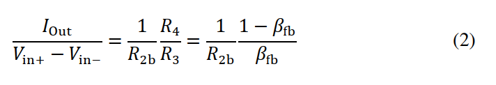
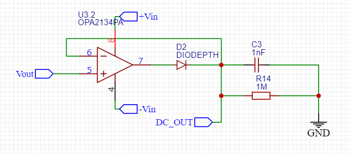
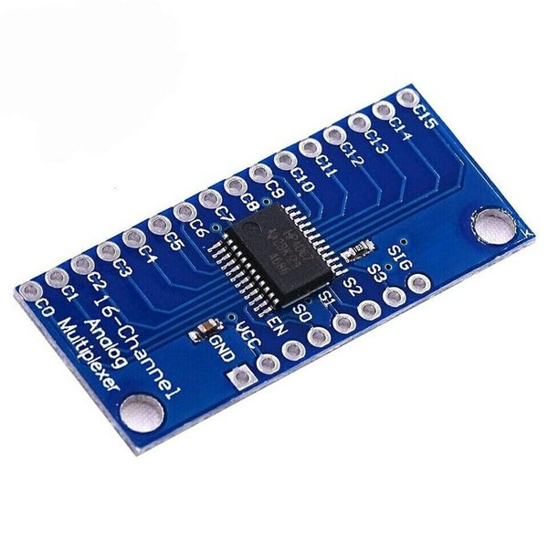

# EIT-Microcontroller
Electrical Impedance Tomography using ESP32 S2 microcontroller with MicroPython

Creating an Electrical Impedance Tomography device using ESP32-S2 as the microcontroller and AD9833 as the function generator

---

## List of Content

- [Abstract](#Absract)
- [Introduction](#Instroduction)
- [Design](#Design)
- [Component](#Component)
- [Programs](#Programs)
- [Result](#Result)

---

## Abstract

Abstract

---

## Introduction

Electrical impedance tomography (EIT) is a non-invasive, radiation-free medical imaging technique. It's used to image the electrical impedance variations inside a volume of interest. In this project I made an EIT using an ESP32-S2 microcontroller, and the EIT that was made had a total of 16 electrodes. One of the goals of this project is to create an EIT that is cheap and easy to create and use.

Previously I had made an EIT using an Analog Discovery 2 for my undergraduate thesis and it was successful, but because the price of the Analog Discovery 2 was relatively expensive, I proposed making an EIT using a microcontroller, namely the ESP32-S2. However, the use of a microcontroller such as ESP has weaknesses, namely the lack of features such as not being able to produce AC signals, not having a good ADC, not being able to read AC signals, etc. so you need to use another module or circuit. but the advantage of using a microcontroller is that it is cheap

---

## Design

The Electrical Impedance Tomography (EIT) that is made consists of several components such as the AD9833 module, amplifier, High Pass Filter, instrument amplifier, VCCS, multi/demultiplexer, AC DC converter, and ADC, and of course, the microcontroller which uses the ESP32-S2

---

## Component

### Positive to Negative Converter

Because all the ICs that are used need dual rail supply (positive and negative) we need to change from positive input to positive and negative. First I tried using LM2662 Module and got the negative supply, but when I tried to connect it to the IC, the result signal was not stable with changing offset. So I tried using another method which is using a voltage divider with buffer on the ground.

</img>

### AD9833

To create the sine wave signal I use the AD9833 dds module, which can produce sine, triangle, and square wave signals with 0-12.5 MHz. The module can be powered with 2.3 V to 5.5 V. This module uses a 3-wire SPI interface.

</img>

When powered the module produces around 0.1 V Vrms of sine wave signal at 30kHz (after a high pass to remove DC)

*Please ignore that the screen is broken*

Because the signal is too small I use Non inverting amplifier to increase the signal and get around 0.5 V of Vrms

### Non-Inverting Amplifier

Non-Inverting Amplifier

</img>

The signal after amplify

### VCCS

The function of VCCS is to get current sources that can be controlled using the input voltage, so the current doesn't exceed some limit. The VCCS that I used is a standard Howland current source that consists of 5 resistors and an Op-amp. 

</img>
</img>

With R1, R3, R4, R2b = 1kΩ, and R2a = 82 Ω

Based on it's equations:

</img>
</img>

> H. Yazdanian, M. Mosayebi Samani and A. Mahanm, "Characteristics of the Howland current source for bioelectric impedance measurements systems," 2013 20th Iranian Conference on Biomedical Engineering (ICBME), Tehran, Iran, 2013, pp. 189-193, doi: 10.1109/ICBME.2013.6782216.

-> So using the equation the current should be around 0.5 mA.

$$ {Iout \over 0.5 V} = {1 \over 1000} {1000 \over 1000} $$

but after testing it using a 215 Ω resistor I get around 0.11 V vrms, and using basic Ohm's law $I = V/R$ , I = 0.511 mA, and using a 955 Ω resistor I get around 0.52 V vrms, so the current is around 0.544 mA.
So after testing it, it should be safe for human

### Instrument Amplifier

The instrument amplifier function as an amplifier from two different signal inputs. For the instrument amplifier (IA), I use AD620 IC. One IA is connected to a reference resistor from VCCS, and the other one is placed at the observed object with the same gain value. The gain equation is:

$$ G = {49.4 kΩ \over RG} + 1 $$

</img>

On the second IA, there's also a High Pass Filter because the signal from the human body will also contain a noise such as Power Line Noise, so we will remove it using a High Pass Filter, I use first-order HPF with a 740 Hz cut-off frequency, with 1 uF capacitor and 220 Ω (215 tested on the multimeter). I first used 1 kΩ (Fc = 159 Hz) but the noise was still present so I tried higher Fc.

### AC to DC Converter

Because the output of the signal is still an AC signal, we need to convert it to a DC signal, so the microcontroller can read it. I used a peak detector as the AC-to-DC converter. consisting of an op-amp, diode, capacitor, and resistor. 

At first, I didn't use a resistor and when I checked using a multimeter I got a satisfied result, but when it was connected to the microcontroller ADC it suddenly went higher than it should have. So because a multimeter usually has around 1 MΩ impedance, I tried connecting a 1 MΩ resistor to it and got a kinda satisfied result. 

### ADS1115

For the ADC I don't use the Microcontroller ADC but I use a module, I use the ADS1115 16bit ADC module 

</img>

### Multi/Demultiplexer

Multi/Demultiplexer used is CD74HC4067 Module

</img>

### ESP32-S2 (Wemos S2 mini)

 

For the microcontroller, I use Wemos S2 Mini, a mini wifi boards based ESP32-S2FN4R2. The reason I use this board is because of the compact size and it has lot of GPIO pin to use, because to drive the multi/demultiplexer I need at least 16 IO pin, then 2 pin for SDA/SCL, and 3 SPI connection

### Electrode

For the electrode, I used 16 regular copper plates with a thickness of 0.2 cm, a height of 5 cm, and a width of 1 cm. Then the electrodes will be attached to a plastic container with a diameter of 13.5 cm at the top, 11 cm at the bottom a height of 6 cm. The electrode is connected with 16 pin IDC wire

---

## Programs

The program is divided into 2 parts, for the microcontroller to get the data, and to process the data into an image. For the microcontroller, I use Micropython simply because I just want to learn
Micropython, and for the image reconstruction I use the PyEIT library for Python.

### Micropython

The IDE I'm using is [Arduino Lab for Micropython](https://labs.arduino.cc/en/labs/micropython)

The Libray for the module that I use:

- AD9833 : [AD9833-mchobby](https://github.com/mchobby/esp8266-upy/tree/master/ad9833)
- ADS1115 : [ADS1115_mpy-wollewald](https://github.com/wollewald/ADS1115_mpy/tree/main)

### PyEIT

To reconstruct the data into the image I use the PyEIT library on python

[PyEIT Github](https://github.com/eitcom/pyEIT) for more info

---

## Result

### Prototype

First I made the prototype using a project board according to the design

For the electrode housing/container, I use a regular plastic bowl, with around 13.5 cm diameter on top, 11 cm diameter on the bottom, and 6 cm height. Then on the electrode housing, I fill it with regular tap water (half of the container). 

To get the data first we need to get the reference (homogenous) data, that is the water-only data. After we get the reference data we can place the anomaly on the container, then we get the data again. 

I tried using a plastic marker as the anomaly and here's the result, I used a 30k Hz sine wave signal

Example of the data results in graph (*Y axis is the voltage magnitude*)

Results of the real placement object and reconstructed image

*Please note that in the image between the real placement image and the result, the image is mirrored on the x-axis*

Based on the result and my past project with EIT, the blue color means the anomaly has a low conductivity such as plastic, if the anomaly is red colored that means the anomaly has a higher conductivity

After the prototype is tested, and it's shown that the prototype can get the data that can be reconstructed into an image with good precision, then we can continue it using PCB

---

### PCB Implementation

Schematic :

PCB Model :

</img>

#### Result

result...

