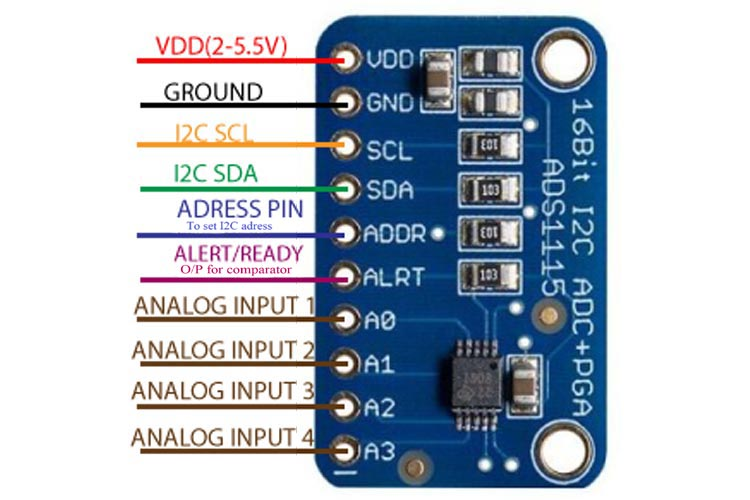

# EIT-Microcontroller
Electrical Impedance Tomography using ESP32 S2 microcontroller with MicroPython

Creating an Electrical Impedance Tomography device using ESP32-S2 as the microcontroller and AD9833 as the function generator

---

## List of Content

- [Abstract](#Absract)
- [Component](#Component)
- [Design](#Design)
- [Programs](#Programs)
- [Result](#Result)

---

## Abstract

Abstract

---

## Component

### Positive to Negative Converter

Because the output of the signal is still an AC signal, we need to convert it to a DC signal, so the microcontroller can read it. I used a peak detector as the AC-to-DC converter. consisting of an op-amp, diode, capacitor, and resistor. 

</img>

At first, I didn't use a resistor and when I checked using a multimeter I got a satisfied result, but when it was connected to the microcontroller ADC it suddenly went higher than it should have. So because a multimeter usually has around 1 MΩ impedance, I tried connecting a 1 MΩ resistor to it and got a kinda satisfied result. 

### AD9833

o create the sine wave signal I use the AD9833 dds module, which can produce sine, triangle, and square wave signals with 0-12.5 MHz, but in this project, I only use 50 kHz. The module can be powered with 2.3 V to 5.5 V. This module uses 3-wire SPI interface.

</img>

When powered with ± 3.25 V it produces around 0.1 V Vrms of sine wave signal at 50kHz (after a high pass to remove DC) and around 0.2 V at 5V supply

(image)

Because the signal is too small I use Non inverting amplifier to increase the signal and get around 0.58 V of Vrms

### Non-Inverting Amplifier

Non-Inverting Amplifier

</img>

### VCCS

The function of VCCS is to get current sources that can be controlled using the input voltage, so the current doesn't exceed some limit. The VCCS that I used is a standard Howland current source that consists of 5 resistors and an Op-amp. 

</img>
</img>

With R1, R3, R4, R2b = 1kΩ, and R2a = 82 Ω

Based on it's equations:

</img>
</img>

> H. Yazdanian, M. Mosayebi Samani and A. Mahanm, "Characteristics of the Howland current source for bioelectric impedance measurements systems," 2013 20th Iranian Conference on Biomedical Engineering (ICBME), Tehran, Iran, 2013, pp. 189-193, doi: 10.1109/ICBME.2013.6782216.

-> So using the equation the current should be around 0.58 mA.

$$ {Iout \over 0.58 V} = {1 \over 1000} {1000 \over 1000} $$

but after testing it using a 215 Ω resistor I get around 0.11 V vrms, and using basic Ohm's law $I = V/R$ , I = 0.511 mA, and using a 955 Ω resistor I get around 0.52 V vrms, so the current is around 0.544 mA.
So after testing it, it should be safe for human

### Instrument Amplifier

The instrument amplifier function as an amplifier from two different signal inputs. For the instrument amplifier (IA), I use AD620 IC. One IA is connected to a reference resistor from VCCS, and the other one is placed at the observed object with the same gain value. The gain equation is:

$$ G = {49.4 kΩ \over RG} + 1 $$

</img>

On the second IA, there's also a High Pass Filter because the signal from the human body will also contain a noise such as Power Line Noise, so we will remove it using a High Pass Filter, I use first-order HPF with a 740 Hz cut-off frequency, with 1 uF capacitor and 220 Ω (215 tested on the multimeter). I first used 1 kΩ (Fc = 159 Hz) but the noise was still present so I tried higher Fc.

### AC to DC Converter

Because the output of the signal is still an AC signal, we need to convert it to a DC signal, so the microcontroller can read it. I used a peak detector as the AC-to-DC converter. consisting of an op-amp, diode, capacitor, and resistor. 

### ADS1115

For the ADC I don't use the Arduino ADC but I use a module, I use the ADS1115 16bit ADC module 

</img>

### Multi/Demultiplexer

Multi/Demultiplexer

</img>

### Electrode

Electroda

---

## Design

Schematic :

PCB Model :

</img>

---

## Programs

The program is divided into 2 parts, for the microcontroller to get the data, and to process the data into an image. For the microcontroller I use Micropython simply because I just want to learn
Micropython, and for the image reconstruction I use the PyEIT library for python.

### Micropython

The IDE I'm using is [Arduino Lab for Micropython](https://labs.arduino.cc/en/labs/micropython)

The Libray for the module that I use:

- AD9833 : [AD9833-mchobby](https://github.com/mchobby/esp8266-upy/tree/master/ad9833)
- ADS1115 : [ADS1115_mpy-wollewald](https://github.com/wollewald/ADS1115_mpy/tree/main)

### PyEIT

[PyEIT Github](https://github.com/eitcom/pyEIT) for more info

PyEIT

---

## Result

Result
